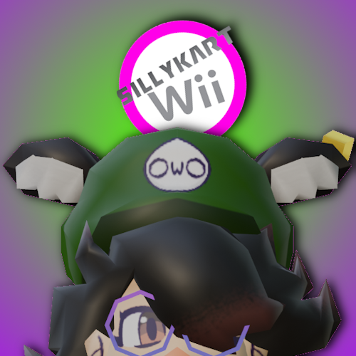

# 🎪 Silly Kart Wii - Official Website

**Professional Mario Kart-style landing page for Silly Kart Wii modpack**



## 🎨 Design

This website features a professional Mario Kart Wii-inspired design with:

- **Official Colors**: 
  - Primary Purple: `#944CB3`
  - Neon Green: `#00FF00`
- **Fonts**: 
  - Bowlby One (Headers & Titles)
  - Fredoka (Body Text)
  - Inter (Fallback)
- **Racing Theme**: Animated stripes, item boxes, and Mario Kart-style buttons

## ✨ Features

### Visual Effects
- ⚡ Racing stripe animated background
- 🎪 Floating item box animations
- 🌟 Sparkle effects on button clicks
- 📊 Scroll progress indicator
- 🎨 Smooth scroll animations
- 💫 Parallax hero section

### Interactive Elements
- 🎮 Mario Kart-style buttons with shine effects
- 🖱️ Hover animations on all interactive elements
- 📱 Fully responsive design
- 🎯 Active navigation highlighting
- ⌨️ Keyboard shortcuts & Easter eggs

### Easter Eggs
1. **Logo Click**: Click the logo 5 times for Rainbow Mode
2. **Konami Code**: ⬆️⬆️⬇️⬇️⬅️➡️⬅️➡️BA for Turbo Mode
3. **Footer Click**: Click footer 7 times for Developer Mode
4. **Console**: Check browser console for hidden messages

## 📁 File Structure

```
sillykart/
├── index.html          # Main HTML structure
├── sillykart.css       # Professional Mario Kart styling
├── sillykart.js        # Interactive features & animations
├── images/
│   └── logo.png        # Silly Kart Wii logo
└── README.md           # This file
```

## 🎮 Sections

1. **Hero Section**: Logo, title, download buttons, stats ticker
2. **Features**: Highlighted features + comprehensive feature grid
3. **Gameplay Modes**: Race, Customization, Online, Technical
4. **Download**: Installation guide, requirements, links
5. **About**: Project vision, tech stack, credits
6. **Community**: Links to GitHub, issues, portfolio

## 🚀 Performance

- Optimized CSS animations
- Intersection Observer for scroll effects
- Debounced scroll handlers
- Reduced animations on low-end devices
- Fast page load times

## 🎨 Color Palette

```css
--primary-purple: #944CB3
--neon-green: #00FF00
--dark-purple: #6B3585
--light-purple: #B768D4
--dark-bg: #1a0a25
--darker-bg: #0f0518
--card-bg: #220d33
```

## 📱 Responsive Breakpoints

- Desktop: 1200px+
- Tablet: 768px - 1199px
- Mobile: < 768px

## 🔗 Links

- [GitHub Repository](https://github.com/Weebo64/SillyKartWii)
- [Weebo64 Portfolio](/)
- [Report Issues](https://github.com/Weebo64/SillyKartWii/issues)

## 💜 Credits

**Website Design & Development**: Weebo64  
**Modpack**: Silly Kart Wii Team  
**Engine**: Pulladium (Pulsar Fork)

---

Made with 💜 by Weebo64 | © 2024 | Mario Kart Wii © Nintendo
